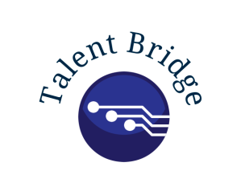

# Resume Analyzer (ATS Tracking System)



The **Resume Analyzer** is a Streamlit-based web application designed to help job seekers optimize their resumes for Applicant Tracking Systems (ATS). It uses Google's Gemini AI to analyze resumes and provide feedback based on a given job description. The app evaluates the resume's alignment with the job requirements, highlights strengths and weaknesses, and provides a percentage match score.

---

## Features

- **Resume Analysis**: Get a detailed evaluation of your resume against a job description.
- **Percentage Match**: Calculate how well your resume matches the job requirements.
- **Keyword Identification**: Identify missing keywords and skills in your resume.
- **User-Friendly Interface**: Simple and intuitive interface powered by Streamlit.
- **Customizable**: Easily customize the app to fit your needs.

---

## How It Works

1. **Upload Your Resume**: Upload your resume in PDF format.
2. **Enter Job Description**: Provide the job description you're targeting.
3. **Get Feedback**: The app uses Gemini AI to analyze your resume and provide feedback, including:
   - Strengths and weaknesses.
   - Percentage match with the job description.
   - Missing keywords and skills.

---

## Installation

### Prerequisites

- Python 3.8 or higher
- Streamlit
- Google Generative AI API key
- Required Python libraries (listed in `requirements.txt`)

### Steps

1. **Clone the Repository**:
   ```bash
   git clone https://github.com/your-username/resume-analyzer.git
   cd resume-analyzer

   Set Up a Virtual Environment (Optional but Recommended):

 ```bash
Copy
python -m venv venv
source venv/bin/activate  # On Windows: venv\Scripts\activate
Install Dependencies:

 ```bash
Copy
pip install -r requirements.txt
Set Up Environment Variables:

Create a .env file in the root directory.

Add your Google Generative AI API key:

plaintext
Copy
GOOGLE_API_KEY=your_api_key_here
Run the App:

 ```bash
Copy
streamlit run app.py
 ```

# Technologies Used
Streamlit: For building the web application.

Google Gemini AI: For resume analysis and feedback.

Python: For backend logic and integration.

PDF2Image: For converting PDF resumes to images.

PIL (Pillow): For image processing.

# Acknowledgments
Thanks to Google for providing the Gemini AI API.

Thanks to the Streamlit team for making it easy to build web apps with Python.

# Contact
For questions or feedback, feel free to reach out:

# GitHub: AyushRaut01

Live Demo
Check out the live demo of the app here (if deployed).

